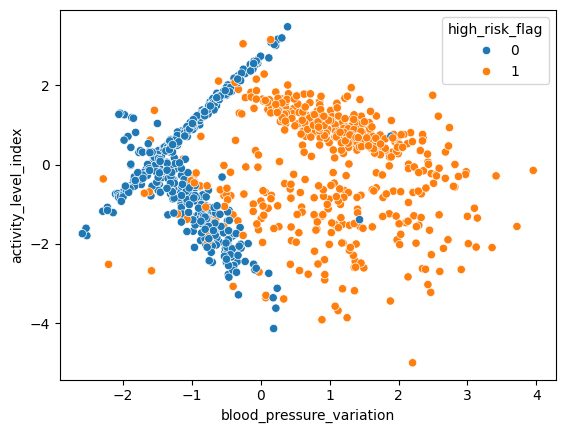
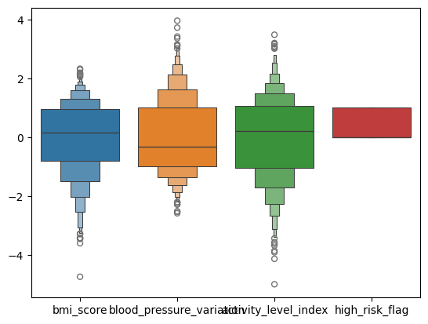
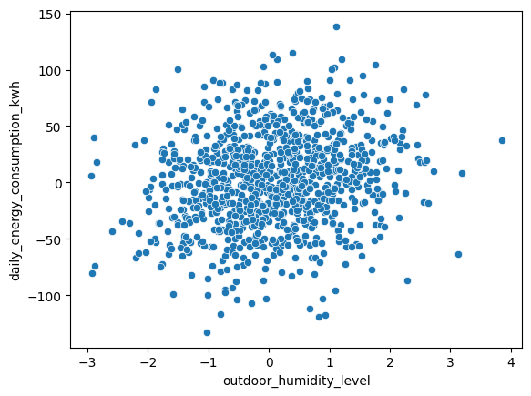
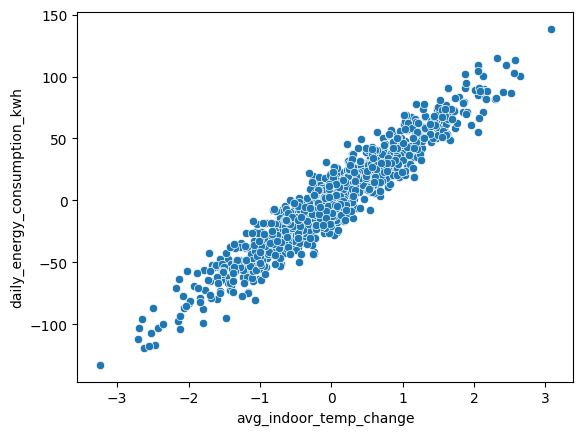
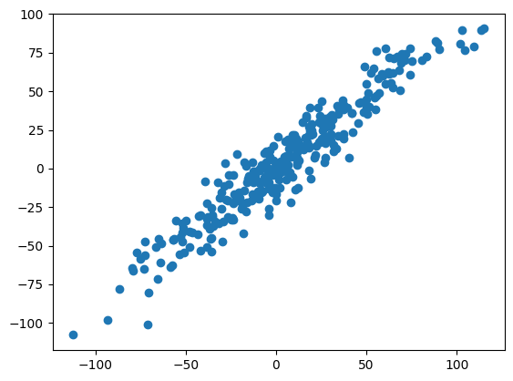
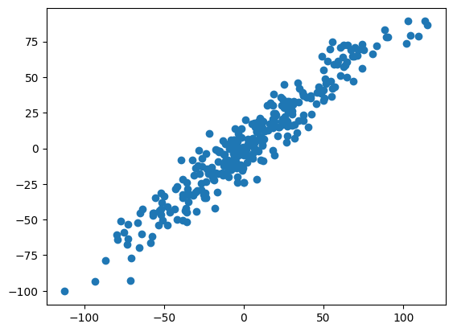
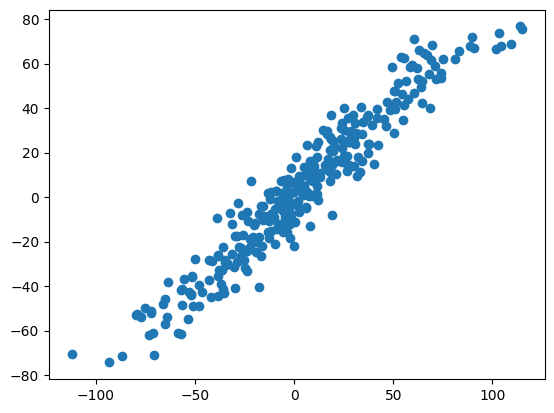

# KNN Classifier and Regressor

This project demonstrates how to use the K-Nearest Neighbors (KNN) algorithm for both classification and regression tasks in a Jupyter Notebook.

The notebook works with two different datasets:

- `12-health_risk_classification.csv`: Health risk classification
- `12-house_energy_regression.csv`: Daily energy consumption prediction

## Project Structure

```text
.
├── 12-health_risk_classification.csv
├── 12-house_energy_regression.csv
├── knn_classifier_regressor.ipynb
├── images/
│   ├── classification_boxenplot.png
│   ├── classification_scatter.png
│   ├── regression_humidity_scatter.png
│   ├── regression_knn5_predictions.png
│   ├── regression_knn7_predictions.png
│   ├── regression_knn35_predictions.png
│   └── regression_temperature_scatter.png
└── README.md
```

## Libraries Used

- pandas
- numpy
- matplotlib
- seaborn
- scikit-learn

Install the required libraries with:

```bash
pip install pandas numpy matplotlib seaborn scikit-learn jupyter
```

Run the notebook with:

```bash
jupyter notebook knn_classifier_regressor.ipynb
```

## 1. Health Risk Classification with KNN

In the first part of the notebook, the target variable `high_risk_flag` is predicted using `bmi_score`, `blood_pressure_variation`, and `activity_level_index`.

Workflow:

- Loaded the dataset with pandas.
- Performed exploratory data analysis.
- Split the dataset into features and target variable.
- Split the data into training and test sets.
- Applied feature scaling with StandardScaler.
- Trained KNeighborsClassifier models with different parameter settings.
- Evaluated model performance using confusion matrix, accuracy, and classification report.

### Classification Visualizations





### Classification Results

The best classification result was achieved with `n_neighbors=3` and `algorithm="kd_tree"`.

| Model | Accuracy |
| --- | ---: |
| KNN Classifier, k=5, auto | 0.952 |
| KNN Classifier, k=5, kd_tree | 0.952 |
| KNN Classifier, k=3, kd_tree | 0.960 |

Confusion matrix for the best model:

```text
[[125   9]
 [  1 115]]
```

## 2. Energy Consumption Regression with KNN

In the second part of the notebook, `daily_energy_consumption_kwh` is predicted using `avg_indoor_temp_change` and `outdoor_humidity_level`.

Workflow:

- Loaded the regression dataset with pandas.
- Inspected the dataset and checked correlations.
- Split the dataset into features and target variable.
- Split the data into training and test sets.
- Applied feature scaling with StandardScaler.
- Trained KNeighborsRegressor models with different neighbor values.
- Evaluated model performance using R2 score, MAE, and MSE.

### Regression Visualizations











### Regression Results

The best regression result was achieved with `n_neighbors=7`.

| Model | R2 Score | MAE | MSE |
| --- | ---: | ---: | ---: |
| KNN Regressor, k=5 | 0.9153 | 9.4214 | 140.4020 |
| KNN Regressor, k=7 | 0.9165 | 9.3314 | 138.3841 |
| KNN Regressor, k=35 | 0.9055 | 9.6214 | 156.6556 |

## Summary

This project shows that the KNN algorithm can be applied to both classification and regression problems. The classification task achieved strong accuracy, while the regression task showed how the number of neighbors affects model performance. Feature scaling is especially important because KNN is a distance-based algorithm.
